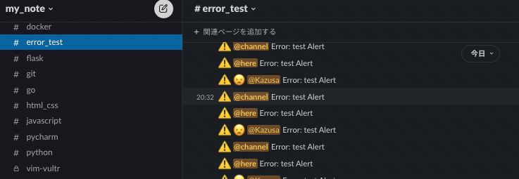

## About

SLACK_Webhook_URL is used to send messages to the specified channel.

## premise
- Mac M1
- Python: 3.10.4

## Details
1. Create `Sample msg App`
2. On Activate Incoming Webhooks 
3. `Add New Webhook to Workspace`
4. Target channel selection
5. Click `Allow`
6. Copy the target Webhook URL
7. Add to `.env`
8. Add to `main.py`
9. Run `main.py`

## Result

